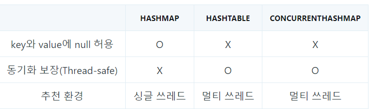

# Map

# HashMap

### Map 이란?

Map은 리스트나 배열처럼 순차적으로 해당 요소 값을 구하지 않고 key를 통해 value를 얻을 수 있는 자료 구조이다.

### 특징

key는 중복을 허용하지 않는다.

value는 중복이 가능하다

### put 과 get

Map은 put과 get을 통해 insert 와  read가 가능하다

```java
HashMap<String, String> map = new HashMap<String, String>();
map.put("people", "사람");
map.put("baseball", "야구");

String str = map.get("people"); // "사람"
```

### containsKey (boolean)

Map에 해당 key가 있는지 조사하여 결과값을 리턴한다.

```java
boolean hasKey = map.containsKey("people");
```

### remove

Map의 항목을 삭제할 수 있다.

```java
String remove = map.remove("people"); // 사람
```

Map의 가장 큰 특징은 순서에 의존하지 않고 key로 value를 가져오는것이다.

하지만 Map에서 입력된 순서가 필요한 경우가 있고, 입력된 key로 sort를 해야 하는 경우가 있다. 그런 경우 HashMap 대신 LinkedHashMap과 TreeMap을 사용해서 해결 할 수 있다.

- LinkedhashMap: 입력된 순서대로 데이터가 출력된다.
- 입력된 key를 기준으로 정렬된다.

### 번외

HashMap은 thread-safe 하지 않다.

따라서 멀티 쓰레드 환경에서 사용하는것은 적합하지 않다.

멀티쓰레드 환경에서는 HashTable 또는 ConcurrentHashMap을 사용해야 한다.

# HashTable

- key와 value에 nul을 허용하지 않는다.
- 동기화를 보장한다.
- get, put, remove에 synchronized 키워드가 붙어있다.

# ConcurrentHashMap

- key와 value에 null을 허용하지 않는다.
- 동기화를 보장한다.
- 사용하는 Entry에 대해서만 락을 건다 → HashTable보다 빠름



싱글 쓰레드 환경이면 HashMap을 멀티 쓰레드 환경이라면 ConcurrentHashMap을 사용하자

HashTable은 synchronized를 사용해 쓰레드간 락을 걸지만 ConcurrentHashMap은 Entry 단위에 락을 걸기 때문에 성능이 훨씬 좋다

# TreeMap

TreeMap은 key - value를 Red-Black Tree에 저장하여 관리한다.

따라서 key값을 기준으로 정렬되어 관리된다.

```java
Map<String, String> map = new TreeMap<String, String>();

map.put("Google", "USA");
map.put("Naver", "Korea");
map.put("Facebook", "USA");

for(Map.Entry<String, String> entry : map.entrySet()) {
System.out.println(entry.getKey() + ":" + entry.getValue());

// 출력 값
// Facebook:USA
// Google:USA
// Naver:Korea
```

TreeMap의 데이터를 entry로 변경하여 출력하면 다음과 같이 정렬된 데이터가 출력된다.

정렬해서 데이터를 관리하기 때문에 엘리먼트 추가.삭제시 logN의 시간이 걸린다.

TreeMap에서는 key에 null 값을 사용할 수 없다. HashMap과의 차이점 중 하나이다.(key를 기준을 정렬하기 때문에 key에 null 값이 불가)

### TreeMap 정렬

```java
TreeMap<Integer, String> map = new TreeMap<Integer, String>((a, b) -> {
			return Integer.compare(b, a);
		});
	
```

TreeMap의 key값에 따라 정렬을 할 수 있다.

comparator를 통해 정렬이 가능하며, 인자로 들어오는 a와 b는 map 객체가 아니라 map의 key가 들어온다.

### Map을 key가 아닌 value로 정렬하기

TreeMap은 key를 기준으로 정렬되기 때문에 comparable이나 comparator를 사용하더라도 value를 기준으로는 정렬을 할 수 없다.

value를 기준으로 정렬하기 위해서는 map의 entrySet을 이용해서 list 형태로 저장한뒤 정렬을 해야한다.

```java
Map<String, Integer> map = new HashMap<>();
map.put("a", 3);
map.put("b", 2);
map.put("c", 1);
List<Map.Entry<String, Integer>> entryList = new LinkedList<>(map.entrySet());
```

생성한 list를 정렬하면 된다

```java
// 람다 사용
entryList.sort(((o1, o2) -> map.get(o1.getKey()) - map.get(o2.getKey())));
```

# LinkedHashMap

LinkedHashMap은 데이터가 입력된 순서를 기억한다.

```java
Map<String, String> map = new LinkedHashMap<String, String>();

map.put("Google", "USA");
map.put("Naver", "Korea");
map.put("Facebook", "USA");

for(Map.Entry<String, String> entry : map.entrySet()) {
System.out.println(entry.getKey() + ":" + entry.getValue());

// 출력 값
// Google:USA
// Naver:Korea
// Facebook:USA
```

map.put() 메서드를 실행한 순서대로 데이터가 출력된다.

LinkedHashMap은 추가, 삭제 시간이 O(1)에 가깝다

- HashMap은 순서를 보장하지 않는다
- TreeMap은 Key 값으로 사용된 클래스의 비교 연산을 활용하여 순서를 보자한다. ( 이 때, Key 값으로 사용한 클래스가 Comparator 인터페이스를 구현하게 한다면 원하는대로 순서를 조정할 수 있다)
- LinkedHashMap은 입력된 순서를 보장한다

# EntrySet

entrySet() 메서드는 Map의 모든 Entry(key-value 쌍)을 가저와 Set 객체로 변환한다.

forEach를 통해 접근이 가능하다

```java
Map<String, String> map = new HashMap<>();
map.put("key01", "value01");
map.put("key02", "value02");
map.put("key03", "value03");
map.put("key04", "value04");
map.put("key05", "value05");

// entrySet()
for (Map.Entry<String, String> entry : map.entrySet()) {
	System.out.println("[key]:" + entry.getKey() + ", [value]:" + entry.getValue());
}
```

또한 keySet() 메서드를 통해 Map의 모든 key를 가져 올 수 있다.

keySet()을 통해 값을 가져오면, 추가적으로 get() 메서드를 호출해야 하기 때문에 entrySet()을 사용하는 것이 더 효율적일 수 있다

```java
// keySet()
for (String key : map.keySet()) {
	String value = map.get(key);
	System.out.println("[key]:" + key + ", [value]:" + value);
}
```

람다식도 가능하다

```java
// Lamda
map.forEach((key, value) -> {
	System.out.println("[key]:" + key + ", [value]:" + value);
});
```

그외에도 entrySet().iterator(), keySet().iterator() 같은 메서드를 이용해서 접근이 가능하다.